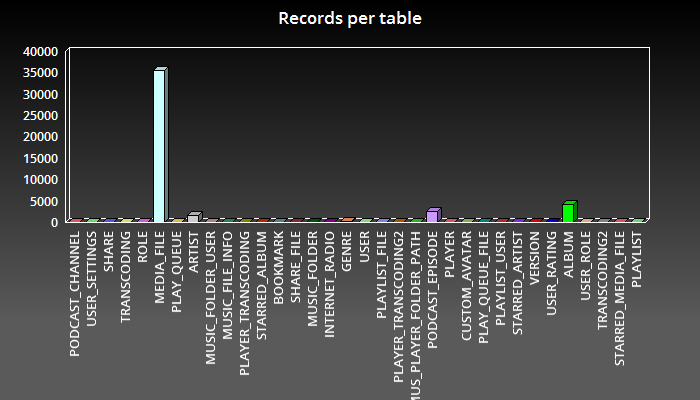

#Introduction

Subsonic is a media streaming server written in Java. Its goal is to construct a library from your sound and video files stored on a local storage and give you access to this library by allowing you to browse and play medias. 
The media files informations are stored in a database but the medias themselves remains on raw file system.

Here is overall Subsonic architecture.

The subsonic database is a simple HSQLDB instance embedded in the Subsonic web application. The main downside of this is that an embedded database is difficult to administrate. You can not access the database from a third party application and it is difficult to backup. In addition, a HsqlDB database needs to be periodically compacted or it will be less and less efficient. 
On the other hand, an embedded HsqlDB database is very quick.

Subsonic uses a special service to populate the database from the media files found on the file system. This is the scanner service. It crawls the folders and add or update (if necessary) the media files description in the database.

All media file informations are contained in a few tables called MEDIA_FILE, ALBUM, ARTIST and GENRE. The other tables are for administration purpose only (PODCAST_EPISODE is for podcasts but I won't discuss that in this article). 
If we take a look at records distribution in the database, we notice that most of datas reside in the MEDIA_FILE table. 

There are very few relations between tables, thus the Subsonic database is like a mono-table database.
In addition, Subsonic uses, beside the database, a Lucene index for search purpose.
 
That's what I call a typically document oriented application. That's not surprising as a media file is actually a document. 
Thus I thought it would be an interesting experience to use an ElasticSearch ?database? in replacement of HSQLDB. And that's i'm working on. 
This article exposes strategies and techniques I used to achieve that goal. Hope you find that interesting or helpful.

#The strategy

Fortunately, as you probably noticed above, Subsonic has a DAO Layer. 
The theory is that it would be easy to move to a different data technology by rewriting the DAO layer. 
As long as the contract of the DAO layer remains unchanged, one can replace the RDBMS storage to ElasticSearch without touching the service layer and thus the rest of the application.
Hence, the main challenge is to design a good mapping and find the appropriate query methods that will allow to reproduce the behaviour of the legacy DAO layer using ElasticSearch. 

#Two main problems

So, is it so easy to rewrite the DAO layer ?
Well, in a way, yes but I had to face two main problems. 

##The id problem

Subsonic uses integers as objects ids. On the other hand, ElasticSearch generate ids for documents that are not numeric. 
I did not want to find a way to make ElasticSearch use of integer ids in place of strings; in fact I don't even try to figure out if it's possible because I think it's better keep the natural behavior.
Neither I wanted to turn Subsonic ids to string as it would have broke the Rest API contract.
Finally, I decided to have both ElasticSearch string ids and an integer id.
The ElasticSearch document id is used between the DAO layer and ElasticSearch but the integer id is used by the Subsonic service layer.

The ElasticSearch document id is generated by ElasticSearch when each document is created. But how the integer id is calculated ? 
In Subsonic, each media file in the database targets a real file or directory on the file system. And for each media file, the absolute path of the file is stored in the MEDIA_FILE table. I then create an integer id by getting the hascode of that path (according to the String.hashcode() method).
And it works. At the moment, I'm not sure it is the best solution ever but that's easy for a POC.    

##The transactional problem

This problem is the main problem I faced. 
ElasticSearch does not react as a relational database in the sense that it is not transactional. 
When you add a document to any index, that document is not immediately visible.
But, in Subsonic, the scanner service inserts media files informations in the MEDIA_FILE table and   subsequently reads these informations to do some more things like making relations. 

#Index and mapping design

As I explained before, Subsonic significant "besiness" data is located in few tables.
The main one is the MEDIA_FILE table. This table actually assembles 3 kind of records. 
- the media files themselves
- the directories
- the albums
Each of these records is identified by a technical unique id, but also by the file/folder path on file system.

Beside, a list of musical genres settle in the GENRE table and a list of artists in the ARTIST table.
You must have also noticed there is an ALBUM table despite the fact that album also reside in the MEDIA_FILE table. We will see later why.

Because ElasticSearch indices are a very flexible structure (remember it's a kind of No-Sql technology), I decided to have only one unique index to represent all of these tables. It seems to me it better fits the ElasticSearch philosophy. I then break the RDBMS relational logic.
A media library is a buch of documents (the audio files) and all information about them will reside in a unique index. 
We'll see later that the ElasticSearch search capabilities will help us get rid of the other tables.

Note that this index will both replace the database and the lucene index Subsonic creates for search.

#Rewriting of the DAO layer

