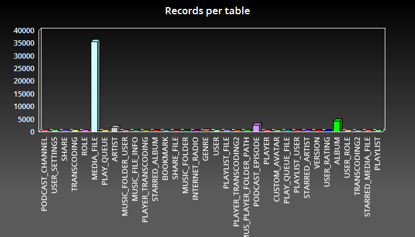

#Introduction

Subsonic is a media streaming server written in Java. Its goal is to construct a library from your sound and video files stored on a local storage and give you access to this library by allowing you to browse and play medias. 
The media files informations are stored in a database but the medias themselves remains on raw file system.

Here is overall Subsonic architecture.


The subsonic database is a simple HSQLDB instance embedded in the Subsonic web application. The main downside of this is that an embedded database is difficult to administrate. You can not access the database from a third party application and it is difficult to backup. In addition, a HsqlDB database needs to be periodically compacted or it will be less and less efficient. 
On the other hand, an embedded HsqlDB database is very quick.

Subsonic uses a special service to populate the database from the media files found on the file system. This is the scanner service. It crawls the folders and add or update (if necessary) the media files description in the database.

All media file informations are contained in a few tables called MEDIA_FILE, ALBUM, ARTIST and GENRE. The other tables are for administration purpose only (PODCAST_EPISODE is for podcasts but I won't discuss that in this article). 
If we take a look at records distribution in the database, we notice that most of datas reside in the MEDIA_FILE table. 



There are very few relations between tables, thus the Subsonic database is like a mono-table database.
In addition, Subsonic uses, beside the database, a Lucene index for search purpose.
 
That's what I call a typically document oriented application. That's not surprising as a media file is actually a document. 
Thus I thought it would be an interesting experience to use an ElasticSearch ?database? in replacement of HSQLDB. And that's i'm working on. 
This article exposes strategies and techniques I used to achieve that goal. Hope you find that interesting or helpful.

#The strategy

Fortunately, as you probably noticed above, Subsonic has a DAO Layer. 
The theory is that it would be easy to move to a different data technology by rewriting the DAO layer. 
As long as the contract of the DAO layer remains unchanged, one can replace the RDBMS storage to ElasticSearch without touching the service layer and thus the rest of the application.
Hence, the main challenge is to design a good mapping and find the appropriate query methods that will allow to reproduce the behaviour of the legacy DAO layer using ElasticSearch. 

#Two main problems

So, is it so easy to rewrite the DAO layer ?
Well, in a way, yes but I had to face two main problems. 


##The id problem

Subsonic uses integers as objects ids. On the other hand, ElasticSearch generate ids for documents that are not numeric. 
I did not want to find a way to make ElasticSearch use of integer ids in place of strings; in fact I don't even try to figure out if it's possible because I think it's better keep the natural behavior.
Neither I wanted to turn Subsonic ids to string as it would have broke the Rest API contract.
Finally, I decided to have both ElasticSearch string ids and an integer id.
The ElasticSearch document id is used between the DAO layer and ElasticSearch but the integer id is used by the Subsonic service layer.

The ElasticSearch document id is generated by ElasticSearch when each document is created. But how the integer id is calculated ? 
In Subsonic, each media file in the database targets a real file or directory on the file system. And for each media file, the absolute path of the file is stored in the MEDIA_FILE table. I then create an integer id by getting the hascode of that path (according to the String.hashcode() method).
And it works. At the moment, I'm not sure it is the best solution ever but that's easy for a POC.    

##The transactional problem

This problem is the main problem I faced. 
ElasticSearch does not react as a relational database in the sense that it is not transactional. 
When you add a document to any index, that document is not immediately visible.
But, in Subsonic, the scanner service inserts media files informations in the MEDIA_FILE table and   subsequently reads these informations to do some more things like making relations. 

#Index and mapping design

As I explained before, Subsonic significant "business" data is located in few tables.
The main one is the MEDIA_FILE table. This table actually assembles 3 kind of records. 
- the media files themselves
- the directories
- the albums
Each of these records is identified by a technical unique id, but also by the file/folder path on file system.

Beside, a list of musical genres settle in the GENRE table and a list of artists in the ARTIST table.
You must have also noticed there is an ALBUM table despite the fact that album already reside in the MEDIA_FILE table. We will see later why.

Because ElasticSearch indices are a very flexible structure (remember it's a kind of No-Sql technology), I decided to have only one unique index to represent all of these tables. It seems to me it better fits the ElasticSearch philosophy. I then break the RDBMS relational logic.
A media library is a bunch of documents (the audio files) and all information about them will reside in a that index. 
We'll see later that the ElasticSearch search capabilities will help us get rid of the other tables.

Note that this index will both replace the database and the lucene index Subsonic creates for search.

In subsonic, one can declare several "media folders". A media folder is a subset of the media library starting at a specified root directory.
It is then possible to grant or not a user to certain media folders, thus this user will only be able to see media files in the media folders he has been granted to.
ElasticSearch has a very convenient feature that allow to run a same query over one or more indices. 
In my new design, each media folder will be stored into a different index so each query will be run for a special user over the indices corresponding the media folders the user is allowed to browse.


#Rewriting of the DAO layer

The DAO layer deals with both the model objects and the backend database.
In subsonic, the DAO layer is composed of a set of DAO classes and a utility class called DaoHelper. 
Each model object has it's own DAO class that reads and writes objects from and to the database.
For example, the MEDIA_FILE table is represented in the java world by the MediaFile model class and the MediaFileDao DAO class.

To turn the DAO layer to ElasticSearch, the goal is to rewrite the DAO classes without changing the model classes.
The new DAO classes will use specific ElasticSearch techniques to read and write objects (we should also say documents) from and to ElasticSearch indices.
I used a combination of the java ElasticSearch client and the query DSL based on Json.

##The DAO utility class

As subsonic implements utilities to access the database in the DaoHelper class, I created an equivalent ElasticSearchDaoHelper. 
The ElasticSearchDaoHelper class creates the indices and provide some tools to run queries against the ElasticSearch server in a unified manner.
 
When first used, the ElasticSearchDaoHelper will create explicitly exactly one index for each media folder as shown below.

```java
          String[] indexNames = indexNames();
          for (String indexName : indexNames) {
            boolean indexExists = elasticSearchClient.admin().indices().prepareExists(indexName)
                    .execute().actionGet().isExists();
            if (!indexExists) {
              elasticSearchClient.admin().indices()
                      .prepareCreate(indexName)
                      .addMapping(MEDIA_FILE_INDEX_TYPE,
                              "path", "type=string,index=not_analyzed",
                              "parentPath", "type=string,index=not_analyzed",
                              "mediaType", "type=string,index=not_analyzed",
                              "folder", "type=string,index=not_analyzed",
                              "format", "type=string,index=not_analyzed",
                              "genre", "type=string,index=not_analyzed",
                              "artist", "type=string,index=not_analyzed",
                              "albumArtist", "type=string,index=not_analyzed",
                              "albumName", "type=string,index=not_analyzed",
                              "name", "type=string,index=not_analyzed",
                              "coverArtPath", "type=string,index=not_analyzed",
                              "created", "type=date",
                              "changed", "type=date",
                              "childrenLastUpdated", "type=date",
                              "lastPlayed", "type=date",
                              "lastScanned", "type=date",
                              "starredDate", "type=date")
                      .execute().actionGet();
            }
          }

```

The `indexNames` array is actually a set of all the media folders names; thus this code  snippet will create identical indexes for each media folder.
Each field declared correspond to a property in the MediaFile model object and is typed. 
You can see that most of these fields are `not_analyzed`. That's important to be able to search records (documents) with exact value of these fields (remember that, here, ElasticSearch is used as a kind of database). 

Then, the ElasticSearchDaoHelper contains a set of utility methods to access these indices.

###Indexing media files

Media files objects are added to the ElasticSearch backend server during the Subsonic scanning process by the scanner service. Actually this consists of indexing new documents into the proper index.
This is the job of the `indexObject` method.

```java
  public void indexObject(SubsonicESDomainObject obj, String indexName) {
    try {
      // Convert the object to a json string representation.
      String mediaFileAsJson = getMapper().writeValueAsString(obj);
      IndexResponse indexResponse = getClient().prepareIndex(
              indexName,
              ElasticSearchDaoHelper.MEDIA_FILE_INDEX_TYPE)
              .setSource(mediaFileAsJson).setVersionType(VersionType.INTERNAL).get();
      }
    } catch (JsonProcessingException e) {
      throw new RuntimeException("Error trying indexing object " + e);
    }
  }

```
 
The `indexName` parameter passed to the method is the actual name of the index (and thus of the media folder) in which the document must be created.  
The `obj` parameter must mach a model object that can be stored in the index. Such objects are of class MediaFile or Album for instance.
You can notice that the object is serialized to Json using Jackson prior to be indexed (`getMapper().writeValueAsString(obj)` where getMapper refers to the `com.fasterxml.jackson.databind.ObjectMapper` class).

To achieve this, a slight modification is done on the model objects classes. 

Each model object class implements an interface called `SubsonicESDomainObject` that enhances it with the special fields `ESId` and `version` that represent the special fields _id and _version in the ElasticSearch index.

```java
public interface SubsonicESDomainObject {

  public String getESId();

  public void setESId(String ESId);

  public int getVersion();

  public void setVersion(int version);
}
```

###Updating media files

The ElasticSearchDaoHelper class also has a method that can update an object.

```java
  public void updateObject(SubsonicESDomainObject allReadyExistsMediaFile, SubsonicESDomainObject obj, String indexName) {
    // update the media file.
    try {
      String esId = allReadyExistsMediaFile.getESId();
      int version = allReadyExistsMediaFile.getVersion();
      String json = getMapper().writeValueAsString(obj);
      UpdateResponse response = getClient().prepareUpdate(
              indexName,
              ElasticSearchDaoHelper.MEDIA_FILE_INDEX_TYPE, esId)
              .setDoc(json).setVersion(version).setVersionType(VersionType.INTERNAL)
              .get();
    } catch (JsonProcessingException e) {
      throw new RuntimeException("Error trying indexing mediaFile " + e);
    }
  }
```

###Performing queries

The `ElasticSearchDaoHelper` contains a set of methods to facilitate querying over the indices.

To execute queries, the ElasticSearch java client is used but each query is specified as Json and is placed in a separate resource file (indeed, I hate embedding my string queries in java classes).
In fact, each file containing a query is actually a FreeMarker templates that contains some variables used as parameters for the query.

For instance, this is the ```searchMediaFileByPath.flt``` file that contains a query to find a media file identified by it's unique path.
  
```json
{
    "constant_score" : {
        "filter" : {
            "bool" : {
                "must" : [
                    {"term" : {"path" : "${path}"}},
                    {"type" : { "value" : "MEDIA_FILE" }}
                ]
            }
        }
    }
}
```

And here is the helper method that retrieves an object by its unique identifier.

```java
  public <T extends SubsonicESDomainObject> T extractUnique(String queryName, Map<String, String> vars, Class<T> type) {
    String jsonQuery;
    try {
      jsonQuery = getQuery(queryName,vars);
    } catch (IOException | TemplateException e) {
      throw new RuntimeException(e);
    }

    SearchRequestBuilder searchRequestBuilder = getClient().prepareSearch(indexNames())
            .setQuery(jsonQuery).setVersion(true);
    SearchResponse response = searchRequestBuilder.execute().actionGet();

    long totalHits = response == null ? 0 : response.getHits().totalHits();
    if (totalHits == 0) {
      return null;
    } else if (totalHits > 1) {
      throw new RuntimeException("Document is not unique "+type.getName()+" "+vars);
    } else {
      return convertFromHit(response.getHits().getHits()[0],type);
    }
  }
```

The method convertFromHit is responsible for creating an object from the _source field of a document (ie. it's json representation). 

```java
  private <T extends SubsonicESDomainObject> T convertFromHit(SearchHit hit, Class<T> type) throws RuntimeException {
    T object = null;

    if (hit != null) {
      String hitSource = hit.getSourceAsString();
      try {
        object = getMapper().readValue(hitSource,type);
        object.setESId(hit.id());
        object.setVersion((int)hit.getVersion());
      } catch (IOException e) {
        throw new RuntimeException("Error while reading MediaFile object from index. ", e);
      }
    }
    return object;
  }
```

And then here is a set of methods called ```extractObjects``` whose goal is to extract subsonic domain objects from indices using a query.

```java
    /**
     * Extract objects from indices of certain music folders using a named query.
     *
     * @param queryName The name of the query to use. It refers to the name of a .ftl file that 
     *                  contains the query expressed in json.
     * @param vars A map of parameters and their value to bind to the query (can be null if the 
     *             query has no parameter.
     * @param from The offset index of the first object to extract from the query results. 
     * @param size The number of objects to extract.
     * @param sortClause A sort clause to apply to the query.
     * @param musicFolders The list of music folders and thus indices to consider for the query.
     * @param type The exact type of object being extracted.
     * @param <T> The exact type of object being extracted.
     * @return A list of all extracted objects. may be empty. The size is equal to size or less.
     */
    public <T extends SubsonicESDomainObject> List<T> extractObjects(String queryName, Map<String, String> vars,
                                                                     Integer from, Integer size,
                                                                     Map<String, SortOrder> sortClause,
                                                                     List<MusicFolder> musicFolders, Class<T> type) {
        String jsonQuery;
        try {
            jsonQuery = getQuery(queryName, vars);
        } catch (IOException | TemplateException e) {
            throw new RuntimeException(e);
        }

        return extractObjects(jsonQuery, from, size, sortClause, musicFolders, type);
    }


    /**
     * Extract objects from indices of certain music folders using a json query.
     * 
     * @param jsonSearch A query expressed in json.
     * @param from The offset index of the first object to extract from the query results. 
     * @param size The number of objects to extract.
     * @param sortClause A sort clause to apply to the query.
     * @param musicFolders The list of music folders and thus indices to consider for the query.
     * @param type The exact type of object being extracted.
     * @param <T> The exact type of object being extracted.
     * @return A list of all extracted objects. may be empty. The size is equal to size or less.
     */
    public <T extends SubsonicESDomainObject> List<T> extractObjects(String jsonSearch, Integer from, Integer size,
                                                                     Map<String, SortOrder> sortClause,
                                                                     List<MusicFolder> musicFolders, Class<T> type) {
        SearchRequestBuilder searchRequestBuilder = getClient().prepareSearch(indexNames(musicFolders))
                .setQuery(jsonSearch).setVersion(true);
        return extractObjects(searchRequestBuilder, from, size, sortClause, type);
    }

    /**
     * Extract objects from indices of certain music folders using a searchRequestBuilder.
     *
     * @param searchRequestBuilder A searchRequestBuilder that represents a query.
     * @param from The offset index of the first object to extract from the query results. 
     * @param size The number of objects to extract.
     * @param sortClause A sort clause to apply to the query.
     * @param type The exact type of object being extracted.
     * @param <T> The exact type of object being extracted.
     * @return A list of all extracted objects. may be empty. The size is equal to size or less.
     */
    public <T extends SubsonicESDomainObject> List<T> extractObjects(SearchRequestBuilder searchRequestBuilder,
                                                                     Integer from, Integer size,
                                                                     Map<String, SortOrder> sortClause, Class<T> type) {
        if (from != null) {
            searchRequestBuilder.setFrom(from);
        }
        if (size != null) {
            searchRequestBuilder.setSize(size);
        }
        if (sortClause != null) {
            sortClause.keySet().forEach(sortField -> searchRequestBuilder.addSort(sortField, sortClause.get(sortField)));
        }
        SearchResponse response = searchRequestBuilder.execute().actionGet();
        List<T> returnedSongs = Arrays.stream(response.getHits().getHits()).map(hit -> convertFromHit(hit, type)).collect(Collectors.toList());
        return returnedSongs;
    }
```

You have noticed that all these methods are named the same because they all do the same thing but using a different signature. 
Then it is possible to extract objects using a template file containing a query, a json query or a "compiled" query using an ElasticSearch ```SearchRequestBuilder```.

The ```mediaFolders``` parameter specifies over which indices the query will be run (because each media folder has its own index).
 
##The MediaFileDao class

The ```MediaFileDao``` class is the main component of the DAO layer because the MediaFile object is the main object in Subsonic.
This class has methods to retrieve MediaFile objects from a primary key or search criteria. 
Let's examine to of these methods. 

###Retrieving a MediaFile from its unique path

A mediaFile can be identified by its file path on the file system.

Subsonic based on HSQLDB retrieves a MediaFile Object this way :

```java

    private static final String COLUMNS = "id, path, folder, type, format, title, album, artist, album_artist, disc_number, " +
                                          "track_number, year, genre, bit_rate, variable_bit_rate, duration_seconds, file_size, width, height, cover_art_path, " +
                                          "parent_path, play_count, last_played, comment, created, changed, last_scanned, children_last_updated, present, version";

    private final RowMapper rowMapper = new MediaFileMapper();

    /**
     * Returns the media file for the given path.
     *
     * @param path The path.
     * @return The media file or null.
     */
    public MediaFile getMediaFile(String path) {
        return queryOne("select " + COLUMNS + " from media_file where path=?", rowMapper, path);
    }

```
Where MediaFileMapper is :

```java
    private static class MediaFileMapper implements ParameterizedRowMapper<MediaFile> {
        public MediaFile mapRow(ResultSet rs, int rowNum) throws SQLException {
            return new MediaFile(
                    rs.getInt(1),
                    rs.getString(2),
                    rs.getString(3),
                    MediaType.valueOf(rs.getString(4)),
                    rs.getString(5),
                    rs.getString(6),
                    rs.getString(7),
                    rs.getString(8),
                    rs.getString(9),
                    rs.getInt(10) == 0 ? null : rs.getInt(10),
                    rs.getInt(11) == 0 ? null : rs.getInt(11),
                    rs.getInt(12) == 0 ? null : rs.getInt(12),
                    rs.getString(13),
                    rs.getInt(14) == 0 ? null : rs.getInt(14),
                    rs.getBoolean(15),
                    rs.getInt(16) == 0 ? null : rs.getInt(16),
                    rs.getLong(17) == 0 ? null : rs.getLong(17),
                    rs.getInt(18) == 0 ? null : rs.getInt(18),
                    rs.getInt(19) == 0 ? null : rs.getInt(19),
                    rs.getString(20),
                    rs.getString(21),
                    rs.getInt(22),
                    rs.getTimestamp(23),
                    rs.getString(24),
                    rs.getTimestamp(25),
                    rs.getTimestamp(26),
                    rs.getTimestamp(27),
                    rs.getTimestamp(28),
                    rs.getBoolean(29),
                    rs.getInt(30));
        }
    }
```

This is a classic find by primary key SQL query written with the help of Spring Jdbc.

Now, with the ElasticSearch DAO layer this becomes : 

```java
  /**
   * Retrieve a MediaFile identified by a path.
   *
   * @param path The path.
   * @return
   */
  @Override
  public MediaFile getMediaFile(String path) {
    Map<String,String> vars = new HashMap<>();
    vars.put("path",path);

    return elasticSearchDaoHelper.extractUnique("searchMediaFileByPath",vars,MediaFile.class);
  }
```

Where the ElasticSearch query named ```searchMediaFileByPath``` is stored in a file named searchMediaFileByPath.ftl as follows : 

```json
{
    "constant_score" : {
        "filter" : {
            "bool" : {
                "must" : [
                    {"term" : {"path" : "${path}"}},
                    {"type" : { "value" : "MEDIA_FILE" }}
                ]
            }
        }
    }
}
```

You can notice the ```${path}``` parameter in the query passed to the ```extractUnique``` method invocation.
There is no "RawMapper" here; remember that the object returned is constructed from the _source json representation of the document unmarshalled using jackson.

###Retrieving all songs for an album

The ```getSongsForAlbum``` method retrieves all songs of an album. 

The Subsonic classic implementation is : 

```java
    public List<MediaFile> getSongsForAlbum(String artist, String album) {
        return query("select " + COLUMNS + " from media_file where album_artist=? and album=? and present " +
                     "and type in (?,?,?) order by disc_number, track_number", rowMapper,
                     artist, album, MUSIC.name(), AUDIOBOOK.name(), PODCAST.name());
    }
```

And here is the ElasticSearch DAO layer implementation :

```java
  @Override
  public List<MediaFile> getSongsForAlbum(String artist, String album) {
    Map<String,String> vars = new HashMap<>();
    vars.put("artist",artist);
    vars.put("album",album);
    return elasticSearchDaoHelper.extractObjects("getSongsForAlbum",vars,MediaFile.class);
  }
```

With the query : 

```json
{
    "constant_score" : {
        "filter" : {
            "bool" : {
                "must" : [
                    {"term" : {"albumArtist" : "${artist}"}},
                    {"term" : {"albumName" : "${album}"}},
                    {"type" : { "value" : "MEDIA_FILE" }}
                ],
                "should" : [
                    {"term" : {"mediaType" : "MUSIC"}},
                    {"term" : {"mediaType" : "AUDIOBOOK"}},
                    {"term" : {"mediaType" : "PODCAST"}}
                ]
            }
        }
    }
}
```

#Playing this the datas

Now we have rewritten the mediaFile DAO layer as well as the scannnig process thus we have and index off documents representing both the songs and the albums. 
Then we can go further with the extraordinary capabilities of ElasticSearch to exploit these data. 
At the beginning of that article I mentioned that Subsonic maintain more tables containing important business information : the GENRE and ARTIST tables.
These tables are used to identify the different musical genres and artists contained in the media files.
But actualy, genre and artist are also informations owned by the mediaFiles and album objects themselves. This is a typical database point of view. 
But from the point of view of documents we would just have a look at these documents to know which genres and artists are present in the music collection. 

Let's say you own a collection of records; and tha't probably true because you can remember that in the passed, every one owned a more or less collection of music records.
As a music lover, you generally are able to tell what kind of genre and what artits compose your collection. But a very few personals have constructed the exact list of these artists on a sheet of paper. 
Instead of that, you probably wanted to order your records collection by genre and then by artist. Or may be it is a mess.
With ElasticSearch, we don't need to maintain a list of all artits or genres nor we have to order the records. 
We just need to aggregate music datas when we want to know what is its distribution.

The Subsonic API must respond to questions like :  
 - what are the different genres in the collection and how many songs and album for this genre ?
 - what are the different artists and how many albums of each (and please, can the list of artist be alphabetically ordered ?) ?
 
To respond to this we will play with the documents we got in the index using the ElasticSearch aggregation framework.
 
The method ```MediaFileDao.getGenres``` returns a sorted list of all available genres as ```Genre``` objects. 
The ```Genre``` domain object contains the genre name, the number of albums and the number of songs.

Here is the implementation of the ```MediaFileDao.getGenres``` method.

```java
    public List<Genre> getGenres(boolean sortByAlbum) {

        List<Genre> genres = new ArrayList();

        SearchResponse genresResponse = elasticSearchDaoHelper.getClient().prepareSearch()
                .setQuery(QueryBuilders.typeQuery("MEDIA_FILE"))
                .addAggregation(AggregationBuilders.terms("genre_agg").field("genre")
                        .subAggregation(AggregationBuilders.terms("mediaType_agg").field("mediaType"))).setSize(0).get();


        StringTerms genreAgg = genresResponse.getAggregations().get("genre_agg");
        for (Terms.Bucket genreEntry : genreAgg.getBuckets()) {
            Genre genre = new Genre(genreEntry.getKeyAsString());
            StringTerms mediaTypeAgg = genreEntry.getAggregations().get("mediaType_agg");
            for (Terms.Bucket mediaTypeEntry : mediaTypeAgg.getBuckets()) {
                if ("ALBUM".equals(mediaTypeEntry.getKeyAsString())) {
                    genre.setAlbumCount((int) mediaTypeEntry.getDocCount());
                }
                if ("MUSIC".equals(mediaTypeEntry.getKeyAsString())) {
                    genre.setSongCount((int) mediaTypeEntry.getDocCount());
                }
            }
            genres.add(genre);
        }

        // Sort the list.
        if (sortByAlbum) {
            genres.sort((o1, o2) -> {
                if (o1.getAlbumCount() > o2.getAlbumCount()) {
                    return -1;
                }
                if (o1.getAlbumCount() < o2.getAlbumCount()) {
                    return 1;
                }
                return 0;
            });
        } else {
            genres.sort((o1, o2) -> {
                if (o1.getSongCount() > o2.getSongCount()) {
                    return -1;
                }
                if (o1.getSongCount() < o2.getSongCount()) {
                    return 1;
                }
                return 0;
            });
        }

        return genres;
    }
```

It runs a query over the whole indexes to consider all documents (both songs and albums). A first aggregation ```genre_agg``` dispatch documents in buckets by genre. 
For each genre bucket a subaggregation ```mediaType_agg``` separates documents in two different buckets for songs and albums.

Then the response is read and we just have to extract documents from different buckets. For each genre bucket we create a new Genre object then look at the nomber of documents contained in both songs and albums bucket.

In the same way, we use aggregations in the ```ArtistDao.getAlphabetialArtists``` to construct an ordered list of all artists. 
 
```java
    public List<Artist> getAlphabetialArtists(int offset, int count, List<MusicFolder> musicFolders) {

        List<Artist> artists = new ArrayList<>();

        SearchResponse genresResponse = elasticSearchDaoHelper.getClient().prepareSearch(elasticSearchDaoHelper.indexNames(musicFolders))
                .setQuery(QueryBuilders.typeQuery("MEDIA_FILE"))
                .addAggregation(AggregationBuilders.terms("artist_agg").field("artist").order(Terms.Order.term(true))
                        .subAggregation(AggregationBuilders.terms("mediaType_agg").field("mediaType"))).setSize(0).get();


        StringTerms artistAgg = genresResponse.getAggregations().get("artist_agg");
        for (Terms.Bucket entry : artistAgg.getBuckets()) {
            String artistName = entry.getKeyAsString();
            Artist artist = new Artist();
            artists.add(artist);
            artist.setName(artistName);
            StringTerms mediaTypeAgg = entry.getAggregations().get("mediaType_agg");
            for (Terms.Bucket mediaTypeEntry : mediaTypeAgg.getBuckets()) {
                String mediaTypeKey = mediaTypeEntry.getKeyAsString();
                if ("ALBUM".equals(mediaTypeKey)) {
                    artist.setAlbumCount((int)mediaTypeEntry.getDocCount());
                }
            }
        }

        return artists;
    }
```

#Playing more with Kibana

One valuable stuff with Elasticsearch is being able to easily visualize datas using Kibana.

For example it takes only minutes to create a dashboard to visualize the distribution of musical genres and diplay a list of top artists as shown bellow.


Indeed vidualizations are created using the same aggregation logic explained previously.
The following screenshot shows the construction of the genres visualization. 
We can recognize here the genre_agg/mediaType_agg aggregations organisation used ```MediaFileDao.getGenres``` method.
Each bucket is represented as a part of the pie chart.


It is also very usefull to browse all documents in the indexes filtering them just by clicking.
The following picture shows how easy it is to visualy retrieve all albums of artist Sixteen Horsepower !


